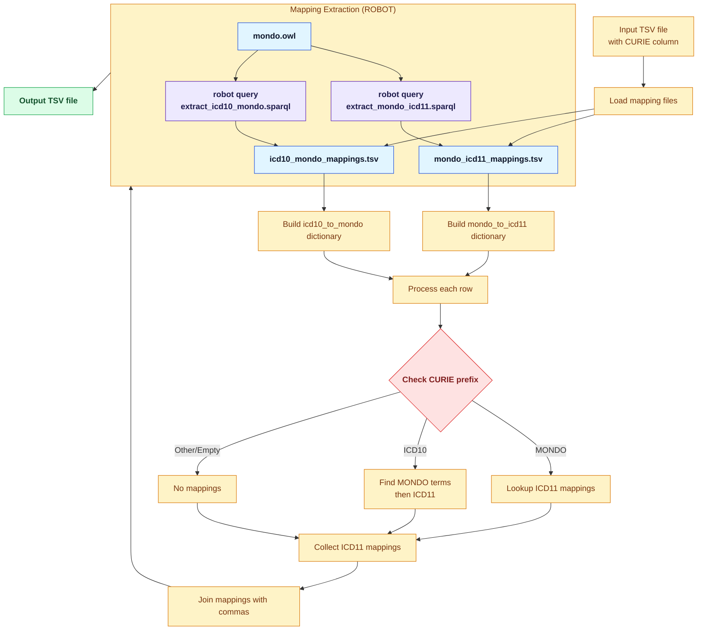

# ICD11 Mappings

This directory contains tools to find ICD11 mappings in Mondo and add these into a TSV file containing MONDO or ICD10 CURIEs.

## Prerequisites

- [ROBOT](https://robot.obolibrary.org/) - for extracting mappings from MONDO ontology
- Python 3 with pandas

## Python Environment Setup

1. Create and activate a virtual environment (macOS/Linux):
   ```bash
   python3 -m venv .venv
   source .venv/bin/activate
   ```
   On Windows (PowerShell):
   ```powershell
   python -m venv .venv
   .venv\Scripts\Activate.ps1
   ```

2. Upgrade pip and install the required Python packages:
   ```bash
   pip install --upgrade pip
   pip install pandas
   ```

3. (Optional) Save the dependencies for later reuse:
   ```bash
   pip freeze > requirements.txt
   ```
   You can then reinstall them with:
   ```bash
   pip install -r requirements.txt
   ```

## Workflow

### Step 1: Extract mappings from MONDO ontology using ROBOT

First, download or use an existing MONDO OWL file (latest tagged releases are published at [GitHub → mondo/releases](https://github.com/monarch-initiative/mondo/releases)), then extract the mappings:

```bash
# Extract MONDO -> ICD11 mappings
robot query -i path/to/mondo.owl -q sparql/extract_mondo_icd11.sparql data/mondo_icd11_mappings.tsv

# Extract ICD10 -> MONDO mappings
robot query -i path/to/mondo.owl -q sparql/extract_icd10_mondo.sparql data/icd10_mondo_mappings.tsv
```

### Step 2: Add ICD11 mappings to your TSV file

Your input TSV should have a column named "CURIE" (or specify with `--curie-column`):

```bash
python add_icd11_mappings.py your_file.tsv
# Optional: specify a custom output location
python add_icd11_mappings.py your_file.tsv -o path/to/output.tsv
```

By default, the script writes the enhanced TSV to `icd11-mappings/data/<input_stem>_with_icd11.tsv`. Use the `-o` flag if you need to send the output somewhere else.

The script will:
- For MONDO CURIEs: Look up ICD11 mappings directly
- For ICD10 CURIEs: Find associated MONDO terms, then get their ICD11 mappings
- Add a new column `ICD11_mappings` with comma-separated ICD11 CURIEs (empty string if no mappings found)

### Example

```bash
# Extract mappings (one-time setup)
mkdir -p data
robot query -i ../ontology-mapping-analysis/data/mondo.owl \
  -q sparql/extract_mondo_icd11.sparql \
  data/mondo_icd11_mappings.tsv

robot query -i ../ontology-mapping-analysis/data/mondo.owl \
  -q sparql/extract_icd10_mondo.sparql \
  data/icd10_mondo_mappings.tsv

# Process your TSV file (default output goes to data/input_with_icd11.tsv)
python add_icd11_mappings.py input.tsv

# Or specify a custom output path
python add_icd11_mappings.py input.tsv -o output/custom_output.tsv
```

## File Structure

```
icd11-mappings/
├── README.md
├── add_icd11_mappings.py      # Main Python script
├── sparql/
│   ├── extract_mondo_icd11.sparql    # Query for MONDO->ICD11
│   └── extract_icd10_mondo.sparql    # Query for ICD10->MONDO
└── data/                              # Output directory for ROBOT extractions
    ├── mondo_icd11_mappings.tsv
    └── icd10_mondo_mappings.tsv
```

## How It Works

The following diagram illustrates the workflow of the `add_icd11_mappings.py` script:



## Notes

- MONDO uses `icd11.foundation:` prefix for ICD11 Foundation mappings (not the linearization)
- ICD10 mappings in MONDO include various prefixes: `ICD10CM:`, `ICD10WHO:`, etc.
- A single MONDO term may have multiple ICD11 mappings
- A single ICD10 code may map to multiple MONDO terms, each with their own ICD11 mappings
- Generated TSV outputs live in `icd11-mappings/data/`; the directory is kept in git with `.gitkeep` while other contents are ignored by default

